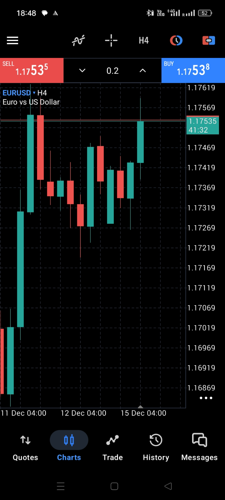

## EURUSD 4H Analysis

## EURUSD 4H Market Analysis

EURUSD is currently trading near the 1.1755 resistance zone, which previously acted as a supply area where price faced rejection. The recent bullish candles indicate short-term buying momentum; however, the market is approaching a historically reactive level, suggesting potential consolidation or rejection before continuation.

Market structure on the 4H timeframe shows:

- A short-term higher-low formation, indicating intraday bullish pressure
- Price approaching range resistance, where liquidity may be resting
- Momentum remains bullish unless price breaks below the 1.1725–1.1730 support zone, which represents recent demand

Scenario outlook:

- A confirmed breakout and sustained close above 1.1760 could open upside continuation toward higher resistance levels
- Failure to break and rejection at current levels may result in a pullback toward 1.1730 support before the next directional move
